---  
layout: post #ensure this one stays like this  
read_time: true # calculate and show read time based on number of words  
show_date: true # show the date of the post  
title:  【彩虹之行】用缤纷的颜色来描述你——天空下的泸沽湖  
date:   2016-07-18 16:00 0800  
description: "Travel to YangShuo"  
img: posts/20160718/1.jpeg  
tags: [travel]  
author: DZQ  
#github: username/reponame/ # set this to show a github button on the post  
toc: yes # leave empty or erase for no table of contents  
---  
>出发时间 2016-06-09  
>出行天数 4  
>人物 LSL  
>人均费用 1000RMB  

【只是路上】  
在没来之前  
我是兢兢业业苦扎在大二末每天不知道忙什么那么累的大学狗  
只是想着每日冗杂如此  
大三、大四、毕业  
“五年后的生活还是一样”——想到这就可怕  
还好我爸妈都喜欢旅游，于是跟着他们的脚步  
我也去过大中国不少地方  
可惜，好多照片都不知道去哪了  
能回味的，只有一点点回忆  
这次，暂且叫它“纯自由行穷游的没有父母参与的提前做好完整攻略的旅行第一次吧”  
从现在开始，多出去看看世界，再写好游记，以后看也罢，怀念也罢，毕竟这些都是年轻的证明阿  
真的很棒 什么都不想 什么都不用做 唯一进行的 只是路上  
  

【出行时间、人物等】  
2016年端午节前后（6.9—6.12），与大学同学一枚（俩妹子）  

【基本路线】  
成都 —— 西昌 —— 泸沽湖 景区门口——大落水村——里格岛——达祖村—— 泸沽湖 镇—— 西昌 —— 成都  

【准备篇】  
1、整理出行的一切交通及住宿准备。  
成都 至 西昌 ：9日早上7：30的大巴，从 成都 东站客运站到 西昌 旅游集散服务中心，车程六个半小时左右，网上提前购买。  
西昌 至 泸沽湖 ：10日早上8:10的大巴，从 西昌 汽车旅游客运中心到 泸沽湖 景区，找某宝代购： https://item.taobao.com/item.htm?ft=t&amp;id=8388156234&amp;spm=a1z02.1.1997525049.3.ndCd97&amp;qa=q ，车程七个小时左右，网上提前购买。  
泸沽湖 回 西昌 ：12日早上8:00的大巴，返回 西昌 汽车旅游客运中心，去程时在车上跟司机购买。  
西昌 回 成都 ：12日晚上19:19的K9472列次火车，到 成都 北站，车程约11个小时，网上提前购买。  
9日住宿：西山居客栈，到 西昌 现找的。  
10日住宿： 泸沽湖 疯鸟国际青旅（大落水村），艺龙提前订。  
11日住宿： 泸沽湖 星空小栈（达祖村），艺龙提前订。  
2、背景了解  
泸沽湖 海拔2690米，是 云南 海拔最高的湖泊，也是 中国 最深的 淡水 湖之一。走进 泸沽湖 ，如同进入了一个神秘的世界，湛蓝的湖水被群山围绕。美妙绝伦的湖光山色间居住着勤劳善良的摩梭人，他们至今还沿袭着古老的母系氏族传统，有“东方女儿国”的美誉。 泸沽湖 的水一天之中变幻无穷，日出时分，雾霭烟霞，湖水一片金红； 朝阳 冉冉，周围山峦倒映其中，则为翠绿；夕 阳西 下，风平浪静，平滑若镜，又成一片墨绿；夜色幽静，微风柔漫，天上星星闪动，湖面波光粼粼。神秘的走婚习俗，多情浪漫的摩梭人和绝美的风景都让人无限神往，难怪约瑟夫 • 洛克 曾在书中称赞这里是神 仙居 住的地方。我们本来是冲着蓝天与星空来的，但初入雨季，欣赏的又是另一番了。  
3、带的东西  
在网上提前了解过这边的天气情况，早晚温差大，太阳出来的时候很晒，时雨时晴。  
本来就是穷游学生党，也没什么东西可带，加上我俩都是嫌麻烦的类型，就塞了一套秋衣，穿着夏装，拿上防晒霜和日用品就去了，还有就是小伙伴专门让她麻麻把小相机寄了过来，好拍照。其实最应该带上路的，是我们自己。  
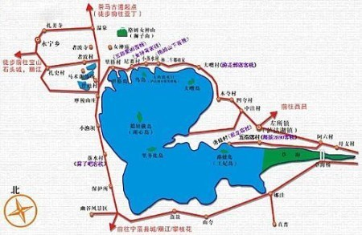  

<big>我们出发啦~</big>
  
  
  
“旅行不在于目的地 而在于沿途的风景和看风景的心情”  
前一天才考完两科期末的我们，没赶上火车，但坐的大巴反而更有味道，一路上都特别好看，也比火车舒服。  

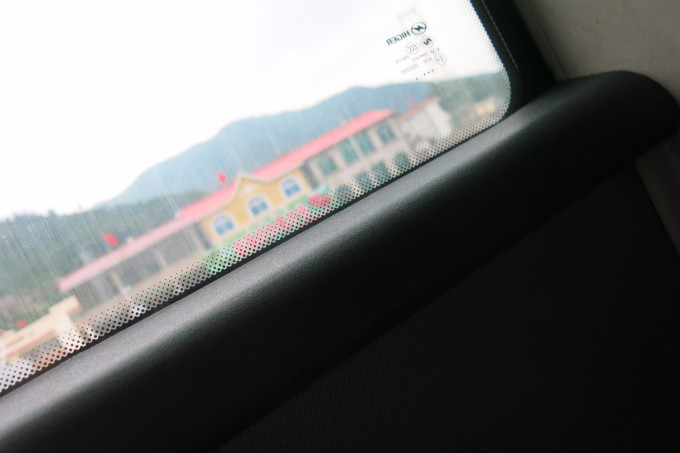  

这张被小伙伴无意间按下快门定格住的彩色房子 好可爱  
哈哈 她拍了就一直把照片在我面前晃悠 顿时化为低龄儿童  
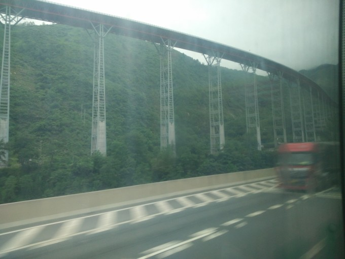  
高架桥上就是网上评的 中国 最美十大公路之一的 雅西 高速  
当时看微博还憧憬着去呢，结果不知不觉间就离她这么近  

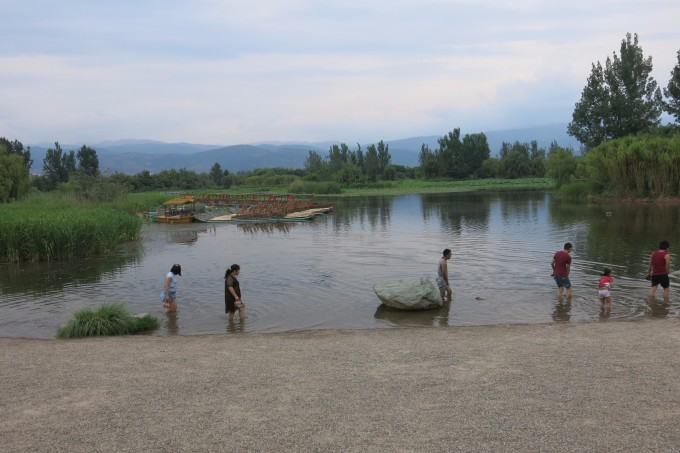  
在第一天到达 西昌 之后，我们没有急着赶去 泸沽湖 ，而是选了邛海公园走了一圈，住了一晚上。  
慢下来，整个世界和时间就都是你的  
离开了熟悉的场景，眼前一切都未知而新鲜，那种感觉很美妙  
：用双脚去探寻前方 用眼睛去捕捉美景 用内心去感知生活  

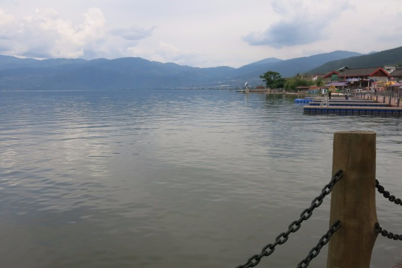  
邛海是**四川**境内除泸沽湖部分的最大淡水湖，她是市区里的公园，人们来来往往，小孩捉着小虾，大人聊着家常，生活就是这么平平淡淡却又到处充满生机。  

<big>泸~沽~湖</big>
  
来之前有百般设想  
你是什么样子的  
欢迎我们吗  
人们好吗  
下雨吗  
然后  
这里呢  
很热情呢  
出现了彩虹  
给予缤纷的颜色  
你又害羞的下起雨  

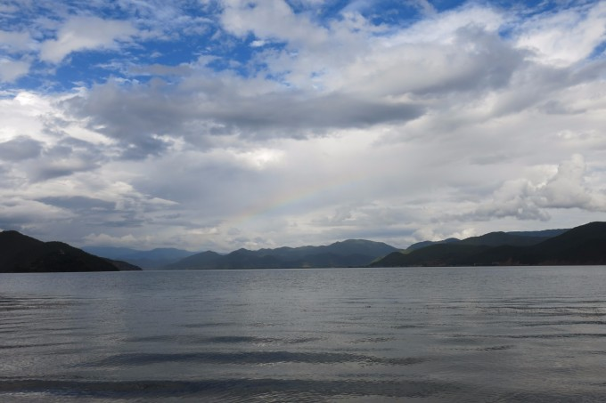  
我们在大落水村码头到处走到处拍的时候，突然小伙伴发现了这支彩虹  
无论相机怎么照都显得特别朦胧，远没有视线里的她那么美丽  

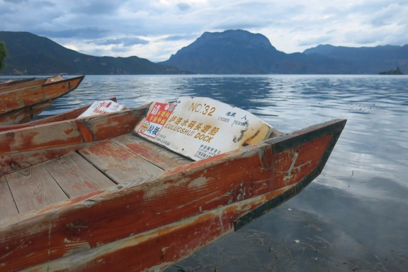  
因为住这里，收拾完从客栈出来接近傍晚，就一直在这玩了  
这是猪槽船，我们没有打算花五十坐去中间小岛  
而是趁他们收工了 坐上锁住的船 在这聊天听歌呆到天黑  
看着船头 总以为自己在向前 安静  

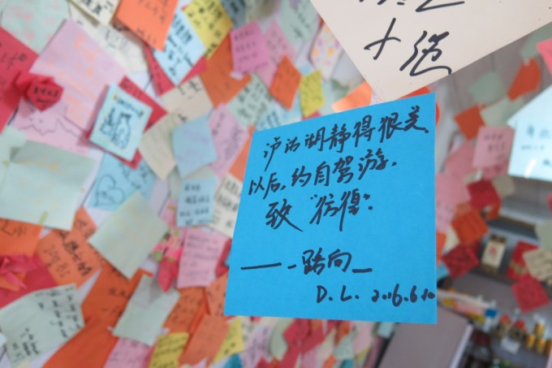  
在这吃的 云南 过桥米线 不知道比 成都 的好吃多少倍 反应过来 大落水村在 丽江 内耶  
还有一点是 这个店被各种颜色的便利贴攻陷了 满眼间好多故事  
我俩也去贴了两张  
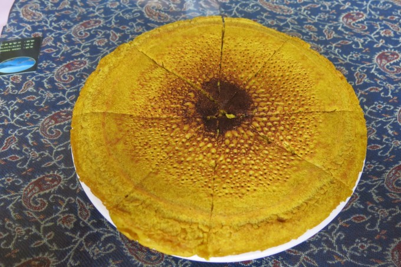  
那天的早餐 吃的太饱  
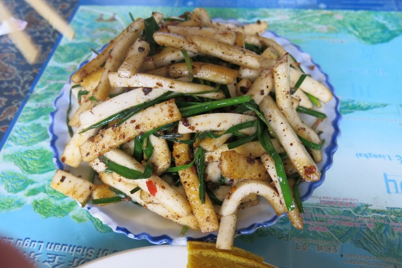  
回来就一直跟人推荐饵块 像年糕一样的口感 反正好吃  

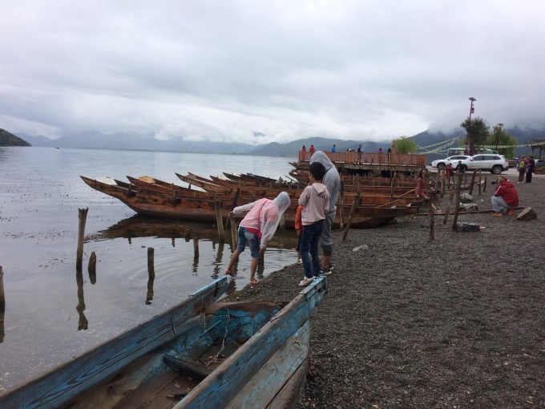  
这天是打算徒步去里格 但是大落水好大 这一上午又在这花完了 但是我们不急  

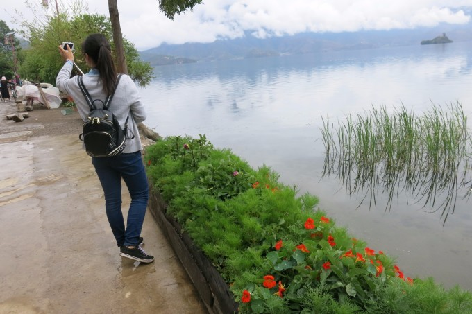  
整条街都在湖边 都是码头  

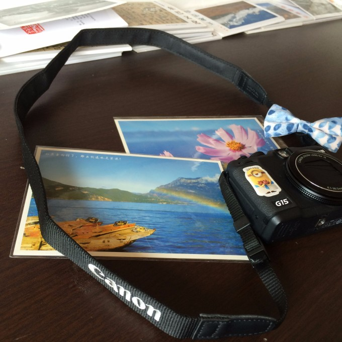  
好笑的是我在明信片上写了我家地址 然后老板说只能寄信封 于是我又在信封上写了一遍我家地址  
结果昨天去找表示并没有收到信封（无奈）  

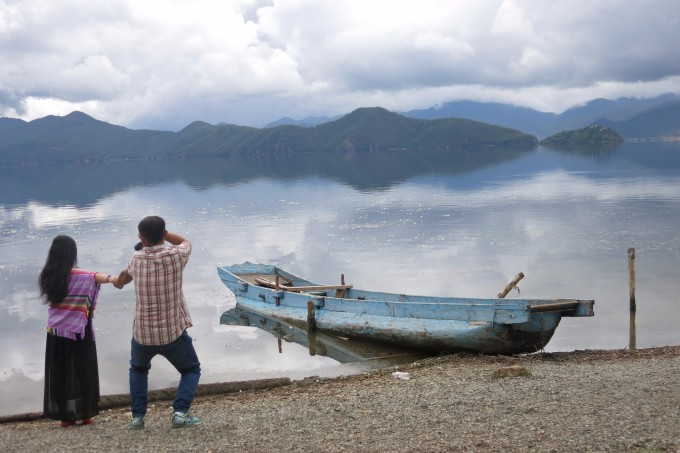  
这是跟我们一起包车去大落水的一对couple 一路上反复碰见他们  
小伙伴偷拍的这张 哈哈  

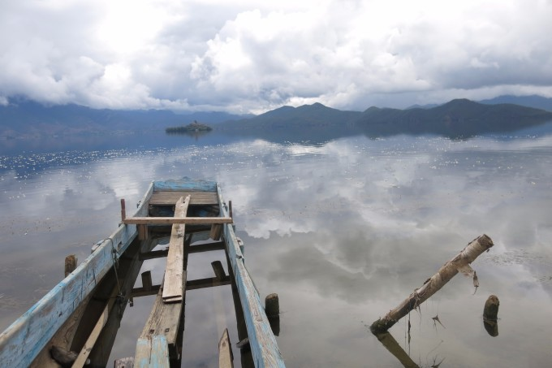  
这个小渔村码头的景色超级好看 走到这里的时候太阳也出来了  
虽然晒 但真的很美 水面像二次元 感觉游到湖的远方就能爬上那些云朵了  

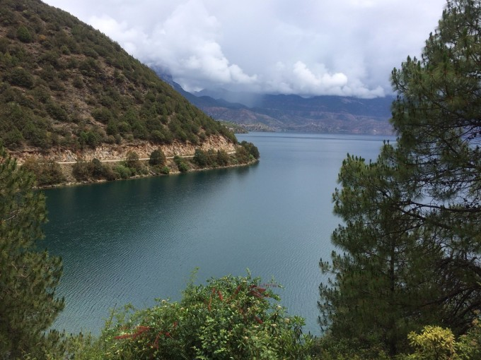  
这儿总是会让我想起 九寨沟  
真的是一天里遇上四季  
一会冻得不行 一 会晒 得不行 伞是十分尴尬的  
徒步才能感受每个地方阿 但好像只有我俩在徒步  

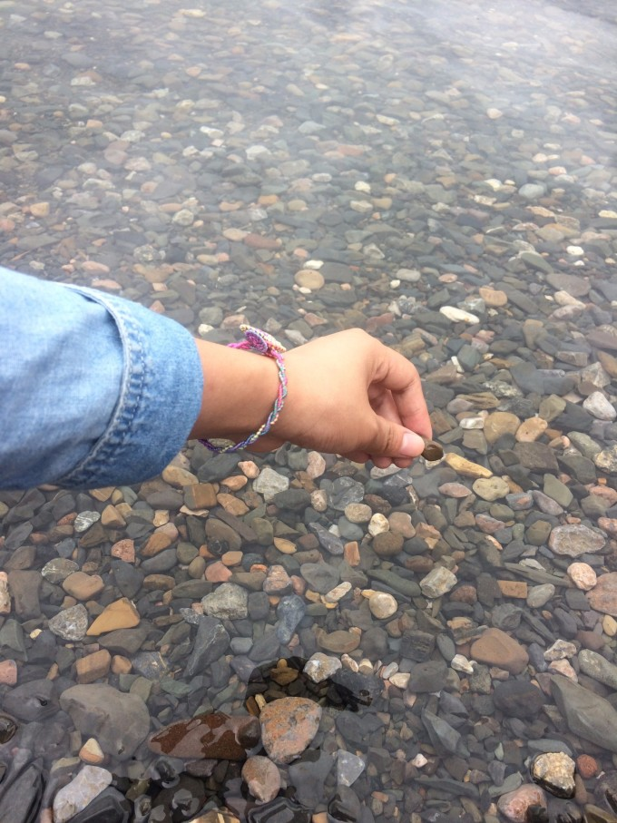  
在情人滩旁边的小海滩 没有人  
“日光下彻,影布石上”  
还在这学打水漂 简单却好玩  
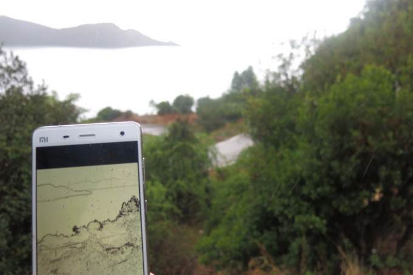  
走了三个小时我们到达里格岛 时间掐得正好 一来就下大雨  
餐厅也刚好给我们做完菜就下班 特色牦牛肉 好吃到爆  
雨太大 眼前也没有让人足以停留的美景 便叫车去达祖村了  
里格是比较商业化的 半岛的景色好 住宿也更贵 但还是偏爱大落水  

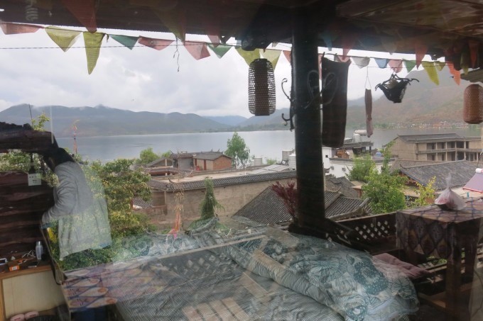  
这是星空小栈 有点像民宿 住着一家人 氛围特别好  
天气晴朗的话躺在床上就能看见星空 我还会再来的  

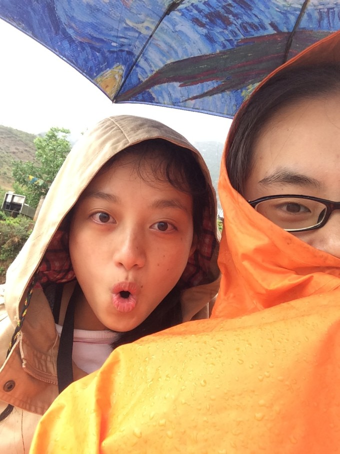  
还想去草海和女神湾 更想骑小电驴感受风驰电掣 我们就去租了一辆比较新的电动车（电足）  
踏上了去前方的路  
女神湾日出日落出了名的 就是担心雨天看不见  
但不管 我还是要骑电动 看看其他的也好啊  

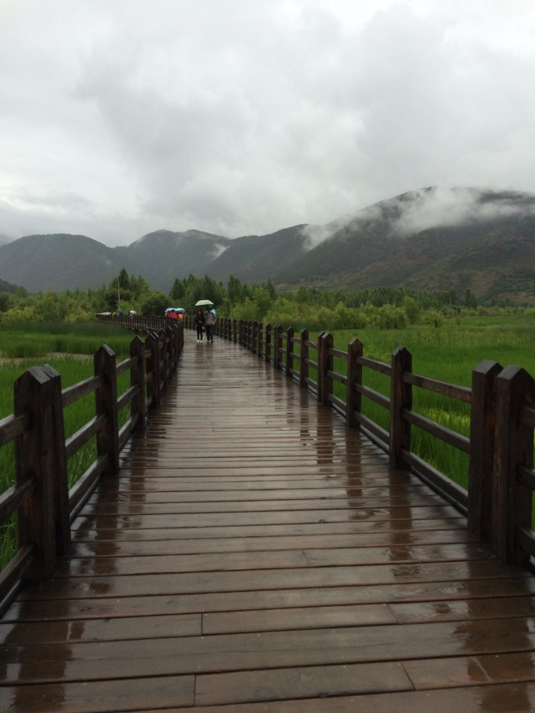  
草海里的走婚桥 要是真的有摩梭人走婚就好了 不然就一个桥 几分钟就走完了  
还是很特别 从周围都是湖水 到周围都是草 走到尽头 又在烧烤摊碰见那对情侣  

<big>最爱的日落</big>
  
从草海出来 还是想赶在日落前去女神湾（赵家湾）看一看  
于是乎 我直接拧到最大码 穿过小巷 转过急弯 上坡 下坡  
到女神湾的路还是挺远的 她就像宝藏 被自然隐在最里处 一辆一辆包车从身旁过  
到了之后 我就在那等着  
结 果阿  

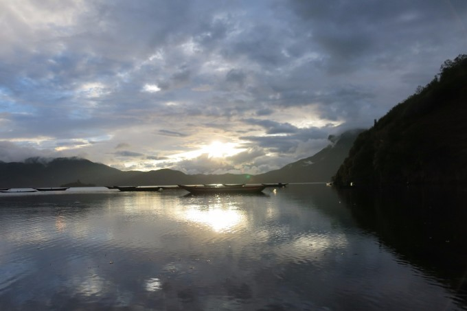  
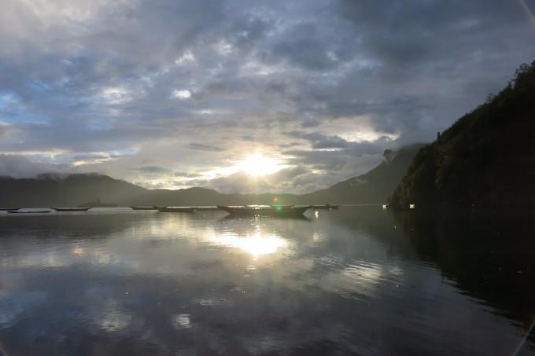  
我爱这 一艘艘船在湖里就像画里的点缀  
阳光从厚厚云层里透出来 我可以看做是跟我一个再见的回忆吗  
好美 好美  

【后记】  
念念不舍的回学校了  
一大堆期末和作业和报告  
但是 慢慢的我不再纠结于一些事了  
因为心里装着一个湖 透明澄澈 看什么都变得可爱了呢  
泸沽湖 我还会再来哦 星空等我啊  
